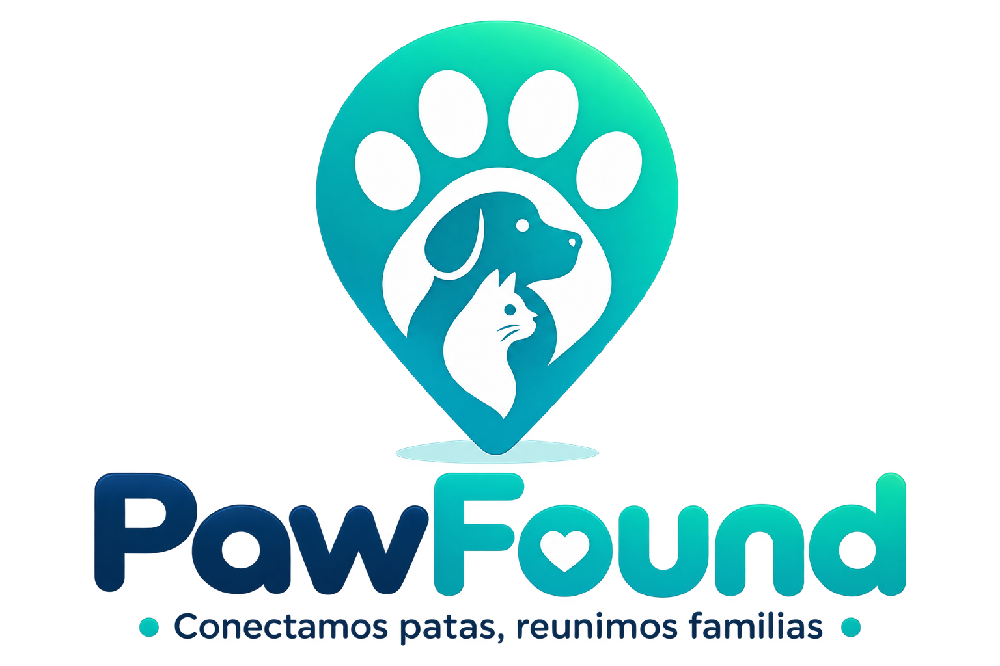

  

# PawFound

PawFound es una plataforma comunitaria para reportar mascotas perdidas o encontradas y facilitar su reencuentro seguro con sus familias.

> Estado: Fase 0 — definición y preparación del proyecto.

  
  
  

## Propósito

Reducir el tiempo entre una pérdida y un reencuentro mediante reportes claros, búsqueda por zona y coordinación responsable de la comunidad.

## Principios

- Bienestar y seguridad animal primero.
- Información verificable y comunicación respetuosa.
- Protección de datos personales y de ubicación.
- Colaboración abierta y trazable.

## Funcionalidades principales

- **Cuentas verificadas**: inicio de sesión con correo, Google, Facebook o Apple; el registro se verifica por SMS y otorga automáticamente la insignia azul de verificado.
- **Mapa comunitario**: todas las mascotas reportadas (perdidas y encontradas) se ven como pines; cada una tiene su propio "círculo de vida", el radio estimado de búsqueda, que se amplía automáticamente con el tiempo.
- **Reportes**: reportar una mascota perdida o encontrada desde el botón `+`.
- **Alerta Ángel**: aviso por SMS geolocalizado a la comunidad cercana cuando se reporta una mascota perdida.
- **Chats por caso**: cada mascota reportada genera automáticamente su propio grupo — "Encontremos a [nombre]" (tema rojo) para perdidas, "Encontremos a su familia" (tema azul) para encontradas — además de mensajes directos y notificaciones de reportes/actualizaciones cercanas.
- **Perfil, privacidad y soporte**: edición de perfil, controles de privacidad y seguridad, y canal de ayuda.

El detalle funcional completo vive en [PRODUCT.md](PRODUCT.md); la referencia visual de cada pantalla está en [`Diseño ideal/`](Diseño%20ideal/).

## Stack técnico

- **Backend**: API en Go, PostgreSQL con PostGIS para búsqueda geoespacial.
- **App**: Expo (React Native), lanzamiento inicial en Android.
- **Proveedores previstos**: Cloudflare R2 (imágenes), Firebase Cloud Messaging (notificaciones push), Upstash Redis (caché y límites de uso), Sentry (errores). Ninguno se habilita hasta completar su evaluación de seguridad y privacidad — ver [docs/legal/incidentes-y-proveedores.md](docs/legal/incidentes-y-proveedores.md).

Detalle de arquitectura en [docs/ARCHITECTURE.md](docs/ARCHITECTURE.md).

## Hoja de ruta inicial

1. Definir alcance, usuarios y criterios de éxito.
2. Diseñar el flujo de reporte, búsqueda y verificación.
3. Construir un MVP accesible y seguro.
4. Validar con personas cuidadoras, refugios y voluntariado.

## Documentación

- [Wiki del proyecto](https://github.com/TomasPosada0626/PawFound/wiki): visión, arquitectura, gobernanza, glosario y preguntas frecuentes.
- [PRODUCT.md](PRODUCT.md): usuarios, propósito, posicionamiento y alcance funcional confirmado.
- [docs/PROJECT_MANAGEMENT.md](docs/PROJECT_MANAGEMENT.md): labels, hitos, épicas, sprints y backlog.
- [docs/legal/](docs/legal/): tratamiento de datos, consentimientos, moderación y respuesta a incidentes; borradores pendientes de revisión legal formal antes de producción.

## Participar

Consulta [CONTRIBUTING.md](CONTRIBUTING.md) para colaborar, [CODE_OF_CONDUCT.md](CODE_OF_CONDUCT.md) para las normas de convivencia y [SECURITY.md](SECURITY.md) para reportar vulnerabilidades.

## Gestión

El trabajo se organiza mediante Issues y pull requests, con un [GitHub Project](https://github.com/users/TomasPosada0626/projects) para el tablero Backlog → Ready → In progress → In review → Done. Las plantillas de incidencias y propuestas están en `.github/ISSUE_TEMPLATE`, y el criterio operativo completo está en [docs/PROJECT_MANAGEMENT.md](docs/PROJECT_MANAGEMENT.md).

## Licencia

[MIT](LICENSE) © 2026 Tomás Posada.
